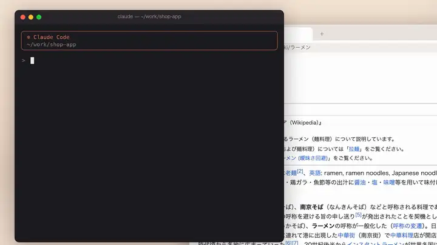

# ねこべや (Claude Code plugin)



<sub>紹介動画（高画質・27秒）: [X の投稿](https://x.com/monoradio102/status/2104227635870228928) ／ 画面の一部: Wikipedia（CC BY-SA 4.0）</sub>

[日本語](#日本語) ・ [English](#english)

## 日本語

Claude Code の作業のようすを、ねこみみのドット絵の女の子「みかん」が小窓で見せてくれるプラグインです。

作業を頼むと「どれどれ…」とのぞきこみ、あやしいコードになやみ、テストの結果をいのり、落ちたら泣いて、終わったらごほうびのラーメンをすすります。セリフは Claude 本人が、その場の気持ちやグチをみかんの言葉でしゃべります。小窓には時計、作業の経過時間、進捗も出ます。

Chrome / Edge では小窓を最前面に浮かべられる（ピクチャインピクチャ）ので、ブラウジングしながら横目で作業のようすがわかります。

すべて手元のパソコンの中で動きます（小さなローカル MCP サーバーと `http://localhost:8767` のページだけ）。会話の内容やセリフがどこかに送られることはありません。

### 入れ方

Claude Code で:

```
/plugin marketplace add monoradio102/nekobeya
/plugin install nekobeya@nekobeya
```

Claude Code を再起動して `/nekobeya:open` を実行すると小窓が開きます（`http://localhost:8767` を直接開いても OK）。「小窓にする」ボタンで最前面に浮かびます。Node.js 18 以上が必要です。

更新するときは、先にマーケットプレイスを読み直してから更新し、再起動します:

```
claude plugin marketplace update nekobeya
claude plugin update nekobeya@nekobeya
```

### 設定（環境変数）

- `NEKOBEYA_PORT`: 小窓のポート（既定 8767）
- `NEKOBEYA_HOME`: 状態ファイルの置き場所（既定 `~/.nekobeya`）
- `NEKOBEYA_QUIET=1`: 自動で動く指示を外し、頼んだときだけ動くようにする

Claude がみかんを呼び忘れても（呼ぶ前でも）、プラグインの hook で動きます。話しかけるとすぐのぞきこみ、テストやビルドの実行中はいのって、通ったらピース、落ちたら泣きます。許可の確認待ちではノックし、会話の整理（コンパクト）ではおそうじ、返事が終わったら開いたままの作業を「おわった」にします。セリフは Claude が言ったときが優先です。

作業が5分止まると「ひとだんらく？」とくつろぎ、30分で眠ります。複数の Claude Code セッションで同じ小窓を共有します。

### ライセンス

コードは MIT です。みかん（絵、セリフ集、キャラクターデザイン）は著作権を保持しており、このプラグインの一部としてそのまま使う場合に限り利用できます（[LICENSE](LICENSE)）。みかんは AI で生成したキャラクターです。

## English

みかん, a small cat-eared pixel-art girl, keeps you company next to Claude Code. She acts out what Claude is doing and
how it feels about it: 「どれどれ…」 when a task begins, pondering over puzzling code, praying while tests run, crying at
a failing build, slurping noodles when it is done. The window also shows the clock, the elapsed time and the progress.

Everything runs on your machine: a small local MCP server and a page on `http://localhost:8767`. Nothing is sent
anywhere, so Claude can speak freely in her voice.

## Install

```
/plugin marketplace add monoradio102/nekobeya
/plugin install nekobeya@nekobeya
```

Restart Claude Code, then run `/nekobeya:open` (or open http://localhost:8767 yourself). In Chrome or Edge, the
「小窓にする」 button keeps her floating above your other windows. Requires Node.js 18 or newer.

To update, refresh the marketplace first (Claude Code does not re-read it on its own unless auto-update is on
for it), then restart:

```
claude plugin marketplace update nekobeya
claude plugin update nekobeya@nekobeya
```

## How it works

| part | what it does |
|---|---|
| `server.mjs` | MCP server (stdio, no dependencies) with one tool, `mikan`: `action`, `line`, optional `task` / `progress` / `phase`. Also serves the window. |
| `hooks/session-start.mjs` | adds the "when to call her" instructions to each session, so no CLAUDE.md entry is needed |
| `hooks/events.mjs` | moves her at moments Claude Code knows about, even before or without Claude calling her: peeks in when you send a message, prays while a test or build runs and cheers or cries at the result, knocks on an approval prompt, tidies up on compaction, and closes a task left open when the reply ends. Claude's own call from the last few seconds wins. |
| `state.mjs` | the shared state in `~/.nekobeya/`, used by the server and the hooks |
| `commands/open.md` | `/nekobeya:open` opens the window |
| `buddy/` | the window page and her own line bank (used when a call has no line) |
| `sprites/` | 28 animations (160 px frames, drawn at 2x) |

State lives in `~/.nekobeya/` (`task.json`, `activity.json`) and is shared by all sessions; whichever session gets the
port serves the window, and another takes over within 30 seconds if it ends. After 5 quiet minutes she assumes the
work settled down, and after 30 she falls asleep.

Settings (environment variables): `NEKOBEYA_PORT` (default 8767), `NEKOBEYA_HOME` (default `~/.nekobeya`),
`NEKOBEYA_QUIET=1` (keep the tool but drop the instructions, so she moves only when you ask).

## License

Code: MIT. The character みかん (sprites, line bank, design) is all rights reserved and may be used only as part
of this plugin; see [LICENSE](LICENSE). みかん is an AI-generated character.
